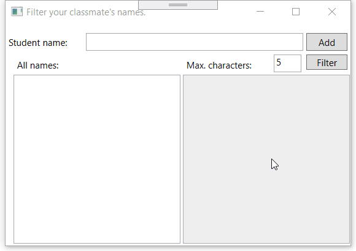

# oe-lussen-reeksen-namefilter-opgave

## Opgave
Maak een applicatie waarin je de namen van je medestudenten kan tikken. Deze worden bijgehouden in een lijst met de naam `lstAll`.
Zorg er vervolgens voor dat in een tweede lijst, `lstFiltered`, enkel de namen van studenten komen te staan binnen het bereik van x-aantal letters.

_In het voorbeeld hierboven zijn namen van medestudenten toegevoegd. "Dieter" staat niet in de tweede (gefilterde) lijst omdat zijn naam 6 karakters lang is. Enkel de namen tot 5 karakters worden getoond._

## Minimumvereisten
* Schrijf een __methode__ die een `List` retourneert met de gefilterde studenten
* Schrijf een __methode__ die een `List` als parameter ontvangt waarmee je de gefilterde listbox kunt updaten.
